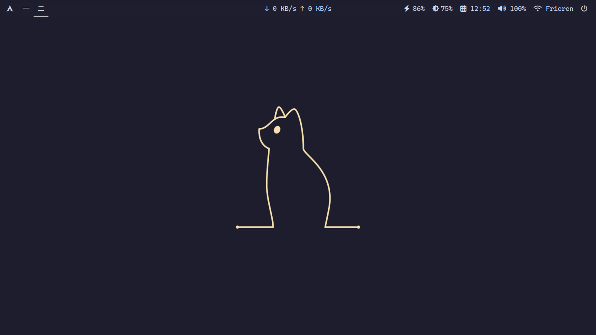
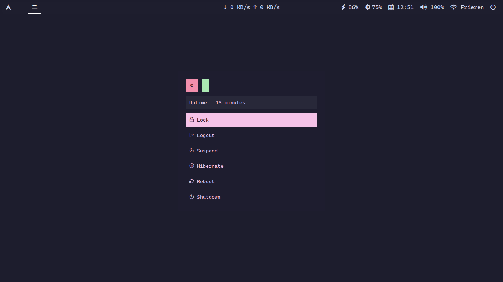
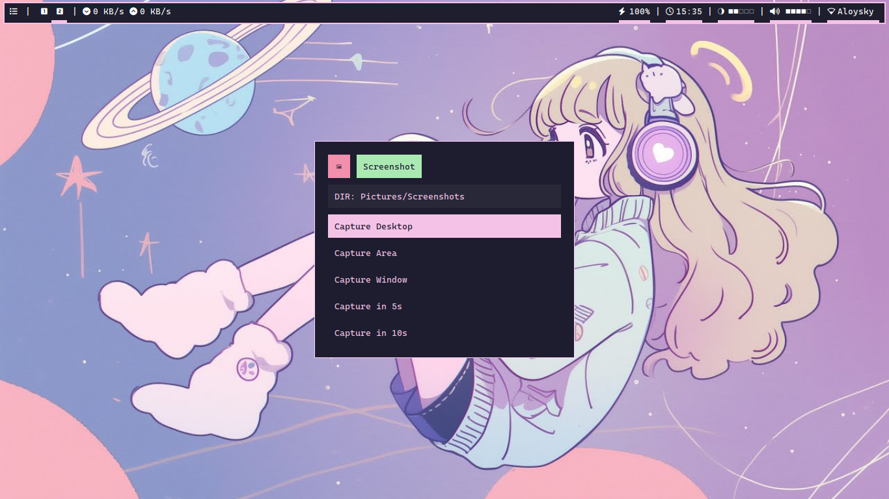
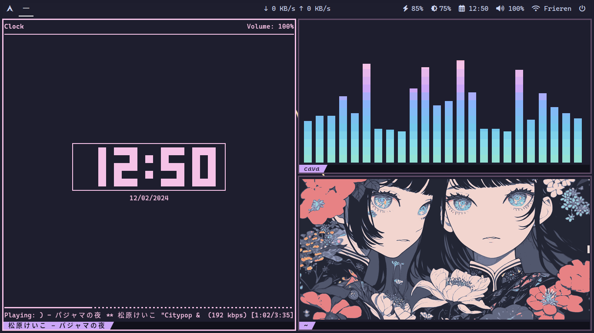
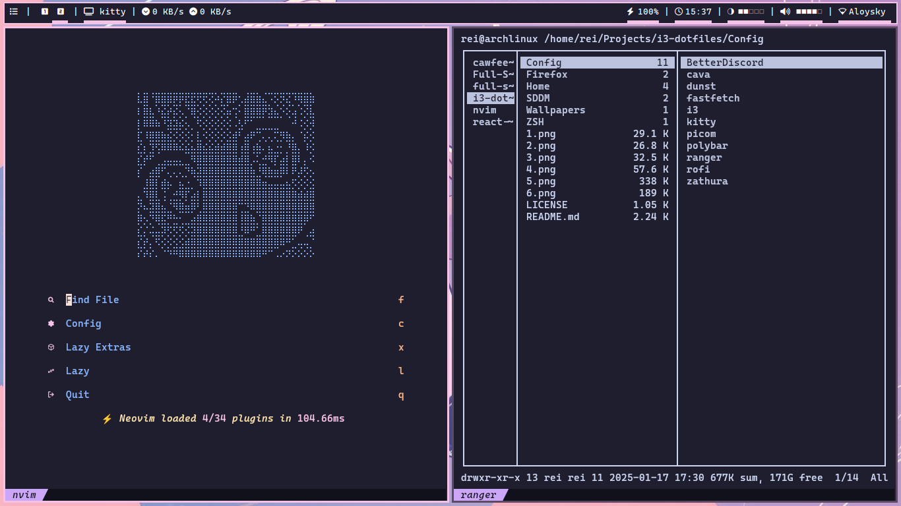

<div align="center">
<h1 align="center"><b>i3 WM</b> - Dotfiles for Arch Linux (ThinkPad X230i)</h1>
</div>

## Getting Started

## Packages Needed for My System

1. Pacstrap

```bash
pacstrap -K /mnt base linux-firmware linux-lts (or linux-zen) base-devel git grub sudo nano intel-ucode thermald tlp networkmanager
```

2. Enable multilib for 32bit Support

```bash
nano /etc/pacman.conf
```

Uncomment multilib section.

3. Enabling NetworkManager, ThermalD and TLP

```bash
systemctl enable NetworkManager
```

```bash
systemctl enable thermald
```

```bash
systemctl enable tlp
```

## After Minimal Install

1. Install Paru

```bash
git clone https://aur.archlinux.org/org
```

```bash
cd paru
```

```bash
makepkg -si
```

2. Install Starter Packages

```bash
paru -S i3-wm vim ranger kitty imagemagick sddm xorg firefox rofi polybar dunst brightnessctl pavucontrol pulseaudio picom feh cava fuse fastfetch cheese zathura zathura-pdf-poppler
```

```bash
systemctl enable sddm
```

```bash
systemctl start sddm
```

3. Install Fonts

```bash
paru -S noto-fonts-emoji noto-fonts-cjk noto-fonts-extra ttf-cascadia-code ttf-cascadia-code-nerd ttf-cascadia-mono-nerd ttf-jetbrains-mono ttf-jetbrains-mono-nerd
```

4. Thunar File Manager Packages

```bash
paru -S thunar thunar-volman tumbler ffmpegthumbnailer file-roller thunar-archive-plugin gvfs gvfs-mtp android-tools android-udev mousepad p7zip unrar
```

5. SDDM Dependencies

```bash
paru -S qt6-svg qt6-declarative qt5-quickcontrols2
```

6. Screenshot Dependencies

```bash
paru -S maim xclip viewnior
```

7. MPD and NCMPCPP

```bash
paru -S mpd ncmpcpp
```

```bash
mkdir ~/.mpd
```

```bash
cd ~/.mpd
```

```bash
touch mpd.db mpd.log mpd.pid
```

```bash
mpd
```

```bash
systemctl start mpd
```

```bash
systemctl enable mpd
```

```bash
systemctl --user enable mpd
```

8. Edit TLP

```bash
su
```

```bash
vim /etc/tlp.conf
```

Change and uncomment battery and AC mode.

```bash
CPU_SCALING_GOVERNOR_ON_BAT=powersave
CPU_SCALING_GOVERNOR_ON_AC=performance
```

Restart TLP

```bash
systemctl restart tlp
```

## Screenshots







